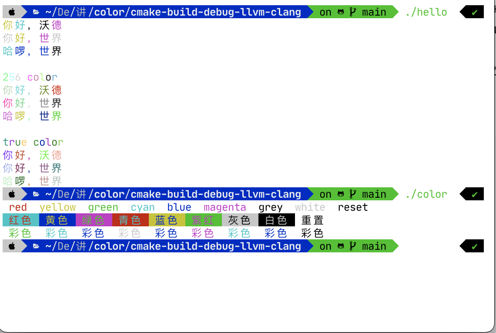

# color
部分借鉴自：[colored-cout](https://github.com/yurablok/colored-cout)  
新增256 color和true color的支持(需要相应的terminal支持，如[Windows terminal](https://www.google.com/url?sa=t&rct=j&q=&esrc=s&source=web&cd=&cad=rja&uact=8&ved=2ahUKEwjd4eLP4PXtAhWCwosBHSTRBwMQFjAIegQIAhAC&url=https%3A%2F%2Fgithub.com%2Fmicrosoft%2Fterminal&usg=AOvVaw1YH7kNCxSWtXhMBaNHmLvG)，  Visual studio调试控制台，MacOS下的terminal.app，[iterm2](https://github.com/gnachman/iTerm2)均支持256 color)  
[](https://github.com/Wongboo/color/releases/)
 
[](https://zhuanlan.zhihu.com/p/339653025)

项目是header-only（仅头文件）的，直接include就能用（至少需要C++14）。如果需编译范例，编译时确认文件格式是UTF-8带BOM的。  
我们来看看，[头文件](color_ostream.h)的使用是多么方便吧，只需要把cout改为rd_cout（256 color为rd256_cout, true color为rdtrue_cout，注意一下命名空间)，cout/wcout，clog/wclog，cerr/wcerr同理）：  
  
hello.cpp:
```C++
//hello.cpp
#include "color_ostream.h"

using namespace color_ostream;

int main() {
    rd_wcout.imbue(std::locale(std::locale(),"",LC_CTYPE));
    rd_wcout << L"你好，沃德\n";
    rd_wcout << L"你好，世界\n";
    rd_wcout << L"哈啰，世界\n";

    rd256_wcout << L"\n256 color" << std::endl;
    rd256_wcout << L"你好，沃德\n";
    rd256_wcout << L"你好，世界\n";
    rd256_wcout << L"哈啰，世界\n";

    rdtrue_wcout << L"\ntrue color" << std::endl;
    rdtrue_wcout << L"你好，沃德\n";
    rdtrue_wcout << L"你好，世界\n";
    rdtrue_wcout << L"哈啰，世界\n";
    return 0;
}
```
color.cpp:
```C++
//color.cpp
#include "color_ostream.h"

using namespace color_ostream;
using namespace std;

int main([[maybe_unused]] int argc, [[maybe_unused]] char *argv[]) {
    cout << clr::red     << " red "
              << clr::yellow  << " yellow "
              << clr::green   << " green "
              << clr::cyan    << " cyan "
              << clr::blue    << " blue "
              << clr::magenta << " magenta "
              << clr::grey    << " grey "
              << clr::white   << " white "
              << clr::reset   << " reset\n";
    wcout.imbue(locale(locale(),"",LC_CTYPE));
    wcout << clr::red     << clr::on_cyan    << L" 红色 "
              << clr::yellow  << clr::on_blue    << L" 黄色 "
              << clr::green   << clr::on_magenta << L" 绿色 "
              << clr::cyan    << clr::on_red     << L" 青色 "
              << clr::blue    << clr::on_yellow  << L" 蓝色 "
              << clr::magenta << clr::on_green   << L" 紫红 "
              << clr::grey    << clr::on_white   << L" 灰色 "
              << clr::white   << clr::on_grey    << L" 白色 "
              << clr::reset                      << L" 重置\n";
    for (size_t i{}; i < 9; ++i)
        wcout << random_color << L" 彩色 ";
    wcout << '\n';

    random_generator rd;
    for (size_t i{}; i < 9; ++i)
        wcout << clrs[random_color.get_num()] << L" 彩色 ";
    wcout << '\n';
}
```
